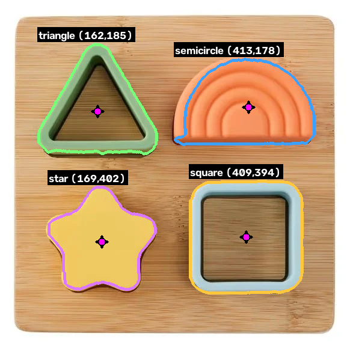

# Shape Detection — classical computer vision

Detects the shapes on a wooden shape-sorter board, names each one, and marks its
centre point. Built for feeding object positions to a UR5 arm, so the **centre
point is the primary output** and the shape name is secondary.



```
type              centre   conf  verts   solid   circ  aspect
-------------------------------------------------------------
square        (409, 394)   0.99      4   0.995  0.854    1.00
semicircle    (413, 178)   0.99      6   0.974  0.718    1.63
triangle      (162, 185)   0.90      4   0.965  0.662    1.08
star          (169, 402)   0.99      5   0.879  0.678    1.04
```

## Quick start

```bash
# Windows
python -m venv .venv; .\.venv\Scripts\Activate.ps1
# macOS / Linux  (see RUNNING_ON_MAC.md for the tkinter caveat)
python3 -m venv .venv && source .venv/bin/activate

python -m pip install -r requirements.txt

python verify.py            # 13 checks, end to end
python pipeline.py test.webp   # print shapes + centre points
python gui.py               # stage-by-stage viewer
```

## Why there is no trained model

The original plan was to train a YOLO model on `data/`. Inspecting that folder
first changed the approach:

- **`data/` is effectively 23 images, not 25,025.** Every class folder holds
  1001 byte-identical copies of a single PNG. Across all 25 folders there are
  only 23 unique images, because `circle`/`sphere` and `cuboid`/`prism` are the
  same picture under two labels. A CNN would be memorising 23 pictures.
- **Two of the four board objects have no class at all** — there is no `star`
  and no `semicircle` in the 25.
- **The measurements do the job exactly.** A star is the only concave shape; a
  semicircle is the only one with a single dominant straight chord. These are
  computed from the contour, not approximated from examples.

Dropping training removed ~2.5 GB of PyTorch/CUDA, the 25-epoch run and the GPU
dependency, while being more accurate here and fully explainable — every verdict
traces to a number the GUI displays.

`data/` is still used, as a regression suite: all 25 reference classes must
classify as expected (in-scope classes by name, everything else as `unknown`).

## How it works

```
image → grayscale → illumination flattened → board mask
      → chroma distance → binary → morphology → contours → centres → classify
```

**Segmentation.** Grayscale alone cannot solve this: the shapes measure 108–200
in luminance and the wood 164–191, so they overlap and no global threshold
separates them. Instead the pipeline measures each pixel's distance from the
board's *own* median colour in CIELAB a\*/b\*, deriving the wood reference from
the image so it self-calibrates. The binary mask it produces is still plain
black and white.

Two details make it hold up under changing light:

- The board is isolated by **saturation**, not brightness. `S = (max-min)/max` is
  unchanged when all channels scale together, which is what dimming, gradients
  and vignettes do. A fixed brightness cut-off breaks the moment you dim the photo.
- The wood reference is fitted as a **smooth surface over wood-only pixels**
  (shapes excluded), so a lighting gradient is tracked rather than averaged over.

**Classification** measures the contour and applies explicit rules, in order of
how decisive each measurement is:

| Test | Fires for | Why it separates |
|---|---|---|
| deep convexity notches, low solidity | **star** | the only concave shape (solidity 0.88 vs ≥0.97) |
| one chord dominating the outline | **semicircle** | dominance 2.6 vs ~1.0 for any polygon |
| fills ~0.5 of its min-area rect | **triangle** | exact for *any* triangle, rotation-invariant |
| fills ~1.0 of its min-area rect | **square** | 0.96 measured, vs 0.83 for a dodecahedron |

Anything matching no rule is `unknown` rather than a guess.

Two things are deliberately *not* used to decide the label:

- **Hu-moment template matching** (`cv2.matchShapes`) is computed and shown, but
  is misleading on these rounded shapes — the star's nearest template is
  `square` at distance 0.001. It is reported as a diagnostic only.
- **Vertex count** is corroborating evidence, not the lead signal. The rounded
  silicone corners make `approxPolyDP` jitter: the triangle reads 4 vertices in
  even light and 5 under a gradient. `area / minAreaRect_area` is stable where
  the vertex count is not.

## Files

| File | Purpose |
|---|---|
| `pipeline.py` | preprocessing stages, contour filtering, centre points; runnable CLI |
| `classify.py` | geometric features and the identification rules; runnable regression check |
| `gui.py` | CustomTkinter stage viewer with live parameter controls |
| `verify.py` | 13-check end-to-end suite |
| `RUNNING_ON_MAC.md` | macOS setup, plus notes on getting pixels to UR5 coordinates |

## The GUI

`python gui.py` shows all nine stages — original, grayscale, illumination
flattened, board mask, chroma distance, binary, morphology, contours, result —
each clickable to enlarge. Every pipeline parameter has a live slider, and each
detected shape is listed with its centre, confidence and the full set of measured
features that produced its label. Results export to CSV.

## Known limitations

- **Blown-out highlights.** The orange arch already sits at V=247/255 in the
  source photo, so it clips early: 6% of its area is saturated at normal
  exposure, 70% at ×1.10 brightness, where it fragments. This is information
  destroyed by the sensor, not something the pipeline can recover — fix exposure
  at the camera. Dimming loses nothing (×0.55 passes comfortably).
- **3D wireframe classes are out of scope.** A silhouette cannot express interior
  structure, so a tetrahedron's outline genuinely *is* a triangle, and a cube's
  is a square. `verify.py` encodes these as expected silhouette aliases.
- **Touching or overlapping shapes** would merge into one contour. The four on
  this board are well separated; watershed segmentation is the fix if it arises.

## Verification

`python verify.py` runs 13 checks: format conversion, exact shape count, correct
names, every centre landing inside its own contour, star and semicircle
identified for the right measured reasons, six lighting variations (dimming,
brightening, two gammas, a horizontal gradient and a vignette), and the 25-class
regression. Centres stay within ~5 px across every lighting variation.
